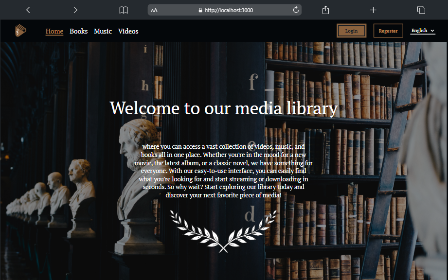
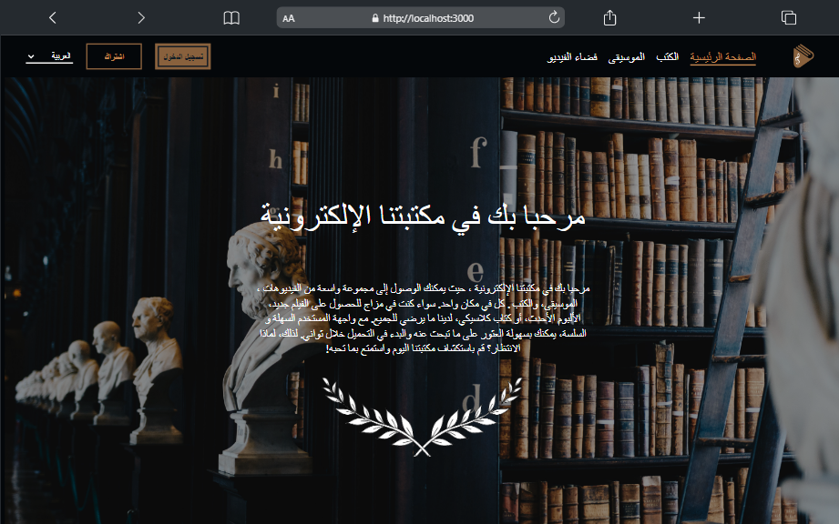
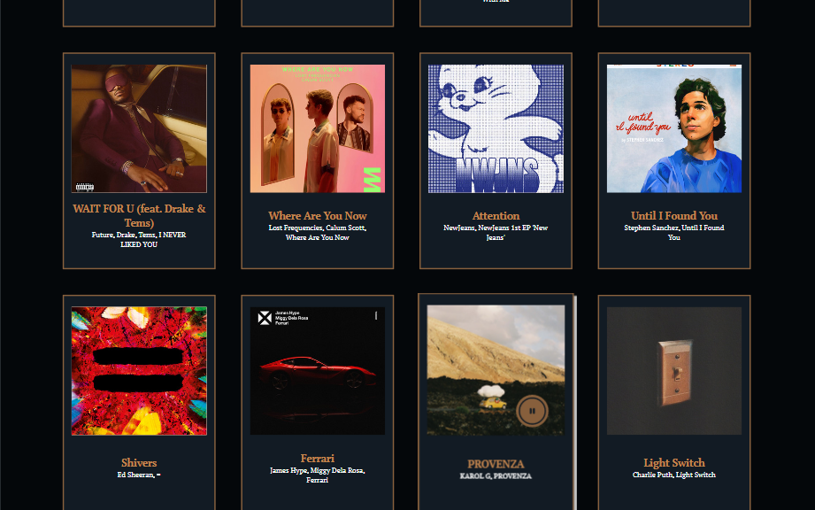
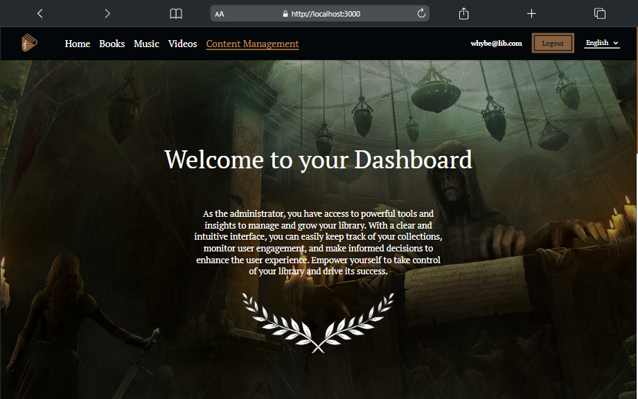
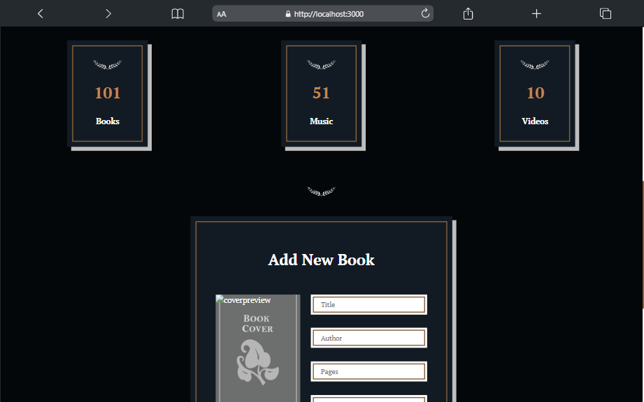

# Multi-Language Media Library Web Application

## Introduction
This is a full-stack web application for a media library that includes books, music, and videos. The library supports multiple languages, making it accessible to users from different parts of the world. The application has a user-friendly interface and includes features such as login/signup and an admin dashboard.

## Frontend
The frontend of the application is built using `ReactJS`, which provides a smooth and responsive user experience. The user interface is designed to be intuitive and easy to use, making it simple for users to find and access the media they're looking for.

## Backend
The backend of the application is built using `NodeJS` and `ExpressJS`. The database for the application is stored as a JSON file, which makes it easy to add new books, music, and videos.

## Features
- Multi-language support
- Login/signup
- Admin dashboard for adding books, music, and videos
- User-friendly interface

## Screenshots

#### Home:



#### Books:


#### Music:


#### Dashboard:



# How to run the application ?
Clone the repository to your local machine
```console
git clone https://github.com/whybe7/MediaLibrary.git
```
# Install the dependencies
- Fronend dependencies (Client Folder):
```console
whybe7@YB:/MediaLibrary/client$  npm install
```
- Backend dependencies (Server Folder):
```console
whybe7@YB:/MediaLibrary/server$ npm install
```
# Start the application
- Fronend Server (React Server):
```console
whybe7@YB:/MediaLibrary/client$  npm start
```
- Backend server (NodeJS(nodemon) Server):
```console
whybe7@YB:/MediaLibrary/server$ npm run dev
```
Open your browser and navigate to [http://localhost:3000](http://localhost:3000) to access the application, the nodejs server is running on [http://localhost:8080](http://localhost:8080)

# Conclusion
This is a complete solution for a multi-language media library. It's easy to set up and use, and provides a user-friendly interface for accessing books, music, and videos. Whether you're an individual or an organization, this application is a great way to manage your media library and make it accessible to a wider audience.
